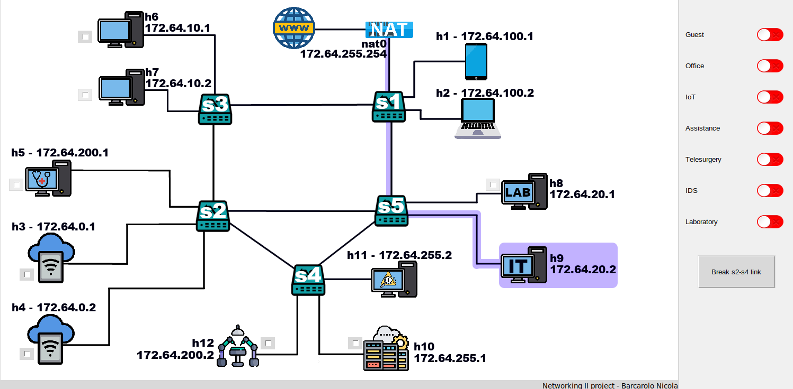
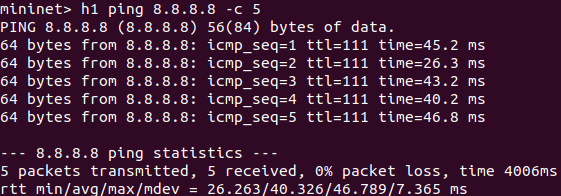
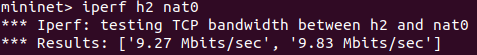
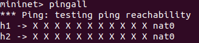
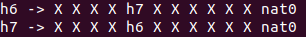
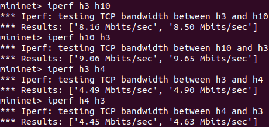
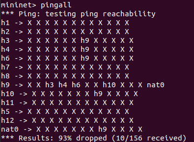
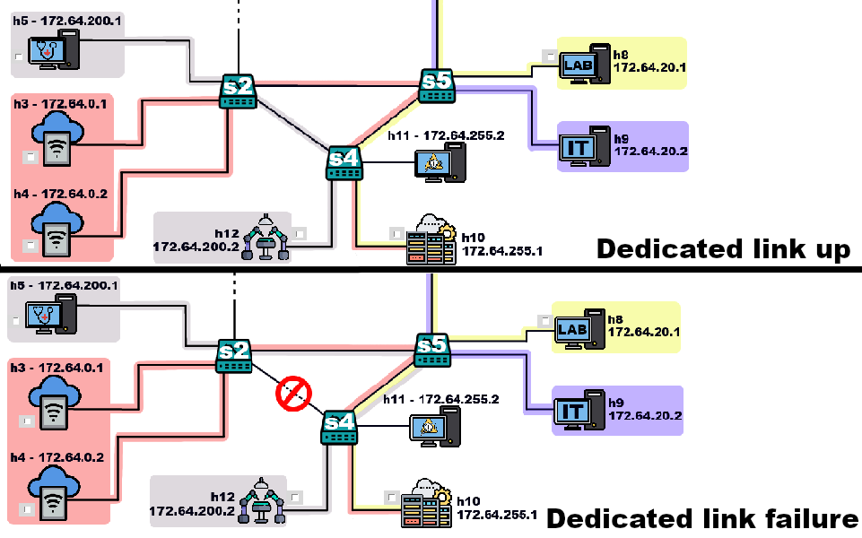
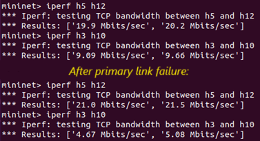
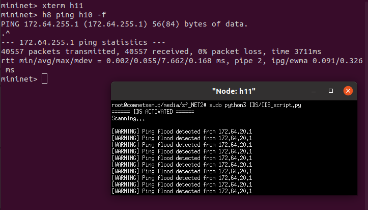

# Networking 2 project: On-Demand Slicing
This repository contains my project for the "Networking 2" course at the University of Trento by professor Granelli. It uses comnetsemu to emulate the network of an hospital facility in which some slices can be dynamically activated/deactivated through a GUI interface which provide a graphical view of the current network status.

##  How to start
Clone the repository to your machine:
```
git clone https://github.com/barcarolo01/NET2_OnDemandSlicing.git
```

In order to start the emulation you will need three terminals. Each of the following operations should be launched on a different terminal **in this order**:
1. Start the ryu controller
 
   ```
   sudo ryu-manager ./ryu-controller.py
   ```
3. Build the topology
   ```
   sudo ./topology_building.py
   ```
5. Launch the GUI
   ```
   sudo ./GUI.py
   ```

Some slices allow the communication between mininet hosts and internet through **nat0**. In order to make the communication possible, the variable **INTERNET_IFACE** on **topology_building.py** must be set with the name of the interface that provides the internet connection to the host machine. Notice that if you are running mininet inside a VirtualBox VM (such as the one provided during the course) the VB network interface must be set on "Bridged Adapter".

Important: When the emulation is terminated it is reccomended to launch the following command to ensure that following execution will be correctly managed.
```
sudo mn -c
```

## Project
This project has been created for didactical purposes only and it does not aim to represent a 100% realistic scenario.
### Topology
In the image below a sketch of the topology is shown: it includes five switches, one NAT device and twelve hosts, classified as follows:
* **h1** and **h2** emulate devices of guests (such as patients and their relatives), which can be connected to the hospital network only to use the free connectivity to the Internet.
* **h3** and **h4** emulate medical IoT device attached to patient bed, whose purpose is to constantly monitor the health parameter of sick people.
* **h5** and **h12** emulate, respectively, the surgeon and the patient workstation in the context of remote surgery (Telesurgery)
* **h6** and **h7** emulate the workstations for one of the offices of the hospital
* **h8** emulates a workstation inside a laboratory used by healthcare workers
* **h9** emulates a worksation of the IT office, who manage the network and communication system of the structure
* **h10** emulates a Dataserver in which information about patients and their medical record are stored.
* **h11** emulates an Intursion Detection System (IDS) used to monitor the traffic toward the Datacenter and to detect possible attacks from malicious devices.


### Slices
Using the toggle buttons on the right side of the GUI, it is possible to dynamically enable/disable the following slices. If the activation/deactivation is successful, an highlighted shadow appears/disappears behind the devices connected by the slice.
The only slice always active is the one that allows the IT workstation (**h9**) to access the internet through **nat0**.




#### *GUEST slice*
This slice connects guest devices to internet through nat0. Traffic from a guest device to any other hospital device is blocked. Through QoS queues, each guest devices is allowed to use a maximum of 10 MBit/s to access the internet.

h1 is able to ping an external device (8.8.8.8):



The maximum bandwidth between h2 and nat0 is about 10 MBit/s:



While guest slice is active the communication between guest devices is blocked:




#### *Office slice*
It simply allow the communication between office workstations (**h6** and **h7**) and Internet. Unlike to the previous one, this slice allows also the communication among office workstations. The communication bandwidth between each pair of devices (**h6**, **h7** and **nat0**) is limited to 30 MBit/s. 



#### IoT slice
IoT devices are supposed to constantly monitor the health parameter of patients, so a constant bandwidth of 10 MBit/s is normally provided to each device in the communication with the Datacenter, where data are stored in order to be analyzed later and to construct a precise medical record of the patient.
It is supposed that IoT devices may need to establish a peer-to-peer communication (for example for synchronization purposes or for data aggregation): for this reason, IoT slice allows also the direct communication between different IoT devices (However, in this case the bandwidth is limited to 5 Mbit/s)



#### Assistance slice
A slice whose shape can be dynamically choosen while the network is running, activated in order to connect the IT workstation (**h9**) with hospital devices that need remote assistance for solving technical problems (for example using telnet or remote desktop protocol). The user can decide which hosts the IT department will support by first selecting the checkboxes near the desired devices and then by turning on the *Assistance* slice using the toggle button.
As an example, the pingall result when **h3**, **h4**, **h6** and **h10** are selected to perform remote assistance is reported below.



Notice that if multiple devices are selected, no direct communication between two hosts to be assisted is allowed.

#### Telesurgery
A slice that allows the communication between surgeon and patient stations for remote surgical operations. Due to the nature of the application, this slice have strict requirements in terms of QoS and reliability: for this reason the traffic for telesurgery travels on a dedicated link. Through the GUI it is possible to simulate a fault in the dedicated link (between **s2** and **s4**).
Since this kind of failure is not acceptable during a remote surgical operation, the reliability is improved by an automatic mechanism able to deviate the traffic from the dedicated link to the longer path composed of **h5**-**s2**-**s5**-**s4**-**h12** in case of failure. The latter path includes few links shared with the IoT slice. Since the traffic for remote surgery can be considered more critical than the other, if a failure on the dedicated link is detected while IoT slice is active, the bandwidth assigned to the communication between IoT devices and datacenter (and vice-versa) is reduced to 5 Mbit/s.






#### Laboratory slice
Connects the LAB terminal to both Internet (through nat0) and Datacenter.
	

#### Intrusion Detection System (IDS)
The script used in the Intrusion Detection System requires scapy. If not already present in your system, please install it with:
```
pip install scapy
```
The aim of the IDS is to monitor the accesses to the datacenter, in order to detect possible attacks that could represent a threat for the system. The script used by the IDS (**h11**) only detects ping flooding attack, but can be expanded in order to detect also other attacks (such as SYN flooding). It simply print a warning message on the console if a flooding is detected (i.e: by default, if more than 100 ping message from the same source are detected in the last 5 seconds).

To test the Intrusion Detection System, make sure to have a slice that allow the communication between a device and the datacenter. **LAB_Datacenter** , **IoT** and **Assistance** (if properly configured) expose the datacenter to other devices.

In this example **LAB_Datacenter** is activated. Make sure that also **IDS slice** is active.

Through mininet, launch a terminal on h11 with:
```
xterm h11
```
Then, of h11 terminal launch the intrusion detection script:
```
sudo python3 IDS/IDS_script.py
```

Finally, on mininet, launch a ping flooding destinated to the datacetner: 
```
h8 ping h10 -f
```

Some warning messages should appear on h11 terminal, as shown in the picture:



